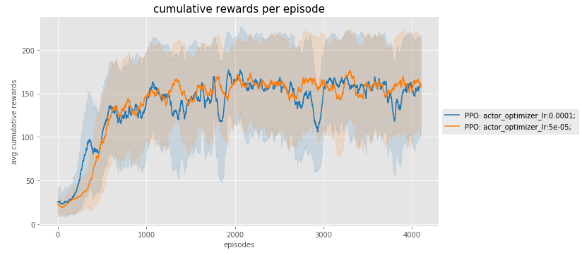
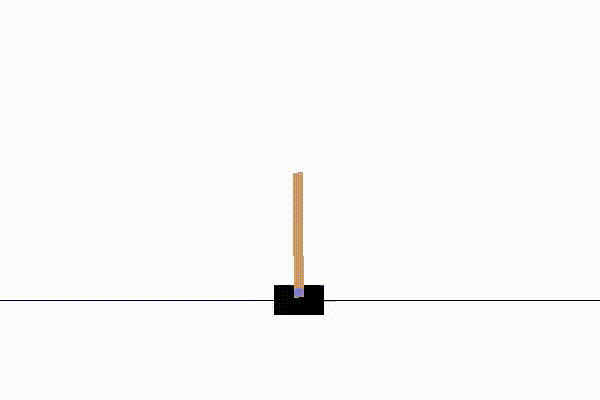

# DDPG


[paper here](https://arxiv.org/abs/1707.06347)

### Cartpole -v0






###### Agent parameters 

```python
actor_init = {'network_init': {'l1_shape': state_shape, 
                               'l2_shape': 64, 
                               'l3_shape': 64,
                               'o_shape': action_shape
                              },
              'optimizer': {'lr': 1e-4},
              'entropy_learning_rate': 1e-2,
              'input_as_image': input_as_image
             }

critic_init = {'network_init': {'l1_shape': state_shape, 
                               'l2_shape': 64, 
                               'l3_shape': 64
                              },
              'optimizer': {'lr': 1e-3},
              'input_as_image': input_as_image
             }


ppo_init = {
    'seed': seed,
    'action_shape': action_shape,
    'discount_factor': .99,
    'input_as_image': input_as_image,
    'num_action': action_shape,
    'epsilon': 0.2,
    'num_epoch': 15,
    'mini_batch_size': 128,
    'actor': actor_init,
    'critic': critic_init
}
```

